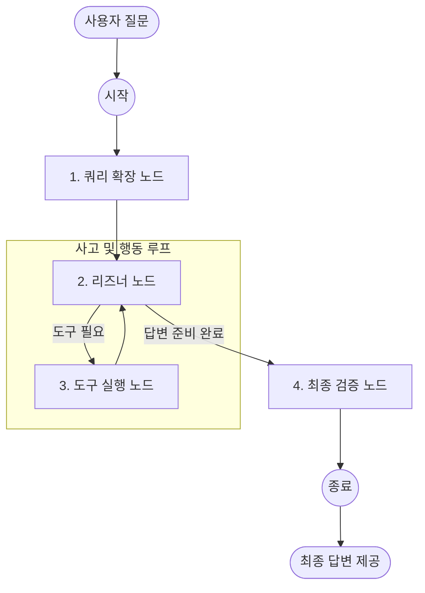

# 🤖 하이브리드 RAG 에이전트 구동 로직 (v12.9)

사용자의 질문에 대해 에이전트가 어떻게 생각하고 행동하는지, 전체적인 흐름과 노드별 역할을 정의한 문서입니다.

---

## 📊 에이전트 워크플로우 (Graph Flow)

---

## ⚙️ 노드별 상세 역할 및 도구 활용 순서

### 1단계: 쿼리 확장 노드 (The Scout)
- **별칭**: 오케스트레이터의 정찰병
- **역할**: 사용자의 자연어를 시스템이 이해하기 쉬운 **지능형 키워드 리스트**로 변환합니다.
- **주요 로직**: 
    - "4번의 5.1번"과 같은 파편화된 정보를 분석하여 `["EQ-SOP-00004", "5.1"]` 키워드 추출.
    - 질문의 성격이 '단순 검색'인지 '심층 검증'인지 1차로 판별.

### 2단계: 리즈너 노드 (The Brain)
- **역할**: 에이전트의 중심 두뇌로, **"무엇을 더 찾아봐야 할까?"**를 고민합니다.
- **사고 메커니즘 (ReAct)**:
    - **Thought**: 현재 정보가 충분한지 판단.
    - **Action**: 필요한 도구를 선택 (예: `hybrid_search_sop`).
    - **Observation**: 도구가 가져온 데이터를 읽고 다음 행동 결정.

### 3단계: 도구 실행 노드 (The Hands)
에이전트가 결정한 실제 Python 기능을 수행합니다.
- **`hybrid_search_sop`**: SQL(키워드/ID)과 Vector(의미) 저장소를 동시에 뒤져 가장 관련성 높은 조항을 가져옵니다.
- **`get_document_references`**: Neo4j 그래프를 조회하여 현재 문서와 연결된 다른 규정을 추적합니다.

### 4단계: 최종 검증 노드 (The Auditor)
사용자가 보게 될 **최종 답변의 품질을 결정**하는 가장 중요한 단계입니다.
- **정답 우선 원칙 (v12.9)**: 단순 검색 질문일 경우, 보고서 형식을 생략하고 **찾아낸 조항 번호와 실제 정답**을 최상단에 배치합니다.
- **QA 검증**: 여러 문서의 내용이 서로 충돌하지 않는지, GMP 규정에 어긋나지는 않는지 최종 점검하여 답변의 신뢰도를 높입니다.

---

## 💡 한눈에 보는 요약
| 주체 | 역할 | 비유 | 도구 활용 |
|:---:|:---|:---|:---|
| **Expansion** | 검색어 정제 | 현관문의 안내원 | - |
| **Reasoner** | 판단 및 결정 | 해결사 (전문가) | 도구 선택자 |
| **Tools** | 실제 데이터 수집 | 발로 뛰는 조사관 | SQL, Vector, Graph |
| **Verifier** | 답변 구조화 | 최종 승인권자 (팀장) | 최종 답변 생성 |

> [!NOTE]
> **왜 노드를 나누나요?**
> 각 단계를 노드(Node)로 분리하면, 에이전트가 답변을 생성하는 중간 중간에 사람이 개입하거나 로그를 남기기 매우 쉽기 때문입니다. 특히 v12.9에서는 `Verifier` 노드를 통해 단순 정보 검색 답변의 친절함을 대폭 개선했습니다.
